<p align="center">
  
</p>

<p align="center">
  <a href="https://portfolio-five-omega-y8vld3apbj.vercel.app/">Portfolio</a> &nbsp;/&nbsp;
  <a href="https://jonahchang207.github.io/odyssey/">Odyssey docs</a> &nbsp;/&nbsp;
  <a href="mailto:saphirredragon207@gmail.com">Email</a>
</p>

## I like code that has to deal with the real world

I'm Jonah, a high school student building robots and the software behind them. I write the competition code for VEX V5 team 56S and handle most of the robot's CAD.

Most of my projects start with something noisy or hard to observe: a robot drifting off its path, a camera trying to locate an object, or an autonomous routine that is painful to test. I usually end up building both the system and the tools I need to understand it.

`C++` &nbsp; `Python` &nbsp; `TypeScript` &nbsp; `C#` &nbsp; `PROS` &nbsp; `OpenCV` &nbsp; `ONNX`

## Selected work

| Route | System |
| :--- | :--- |
| **[Odyssey](https://github.com/jonahchang207/odyssey)**<br><sub>C++ / PROS</sub> | Robot localization and autonomous motion using odometry, PID, move-to-pose, and pure pursuit. |
| **[Odyssey Simulator](https://github.com/jonahchang207/odyssey-sim)**<br><sub>TypeScript / simulation</sub> | A virtual VEX field for writing autonomous routines, watching them run, and generating C++ for the robot. |
| **[FrameSight](https://github.com/jonahchang207/FrameSight)**<br><sub>Python / YOLO / ONNX</sub> | A transparent Windows overlay that captures the screen and draws object detections without blocking clicks. |
| **[Handwave](https://github.com/jonahchang207/handwave)**<br><sub>Python / MediaPipe</sub> | Hand tracking that turns pinches and swipes into cursor movement, clicks, scrolling, and dragging on macOS. |
| **[O.R.B.I.T](https://github.com/jonahchang207/O.R.B.I.T)**<br><sub>Python / stereo vision</sub> | A low-cost 360-degree perception project for ranging, bearing, and persistent target tracking. |
| **[56S Override](https://github.com/jonahchang207/56S-Override)**<br><sub>C++ / PROS</sub> | Competition code for VEX team 56S, including autonomous movement, driver control, motors, and pneumatics. |

## The loop

```text
measure what happened  ->  correct the error  ->  build a better way to see it
          ^                                                   |
          +---------------------------------------------------+
```

If you're working on robotics, computer vision, or an engineering project, [send me an email](mailto:saphirredragon207@gmail.com).
