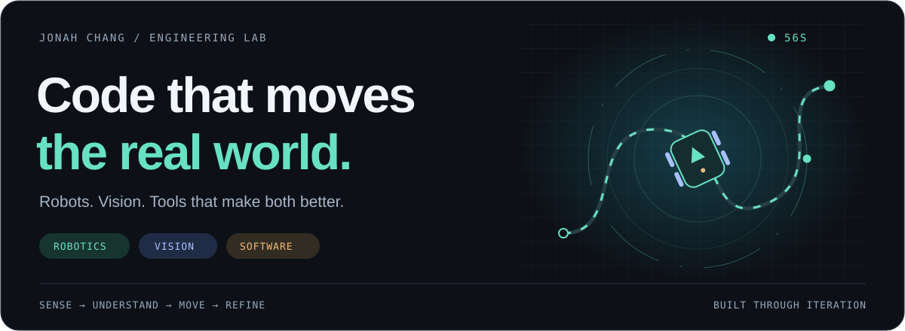
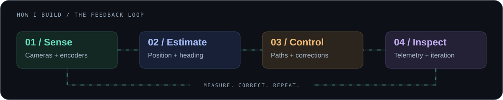
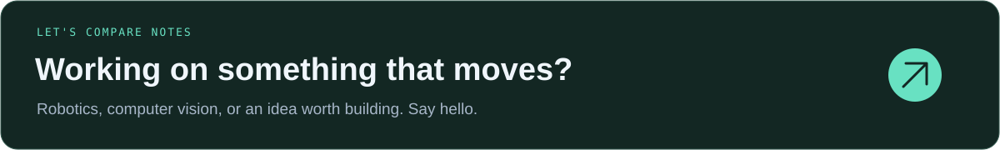

  

  <a href="https://portfolio-five-omega-y8vld3apbj.vercel.app/"><strong>PORTFOLIO</strong></a>
  &nbsp;&nbsp;/&nbsp;&nbsp;
  <a href="https://jonahchang207.github.io/odyssey/"><strong>ODYSSEY DOCS</strong></a>
  &nbsp;&nbsp;/&nbsp;&nbsp;
  <a href="mailto:saphirredragon207@gmail.com"><strong>EMAIL</strong></a>

 

## Hey, I'm Jonah.

I'm a high school student building robots and the software that brings them to life. On **VEX V5 team 56S**, I write competition code and handle most of the robot's CAD. Outside the field, I build computer vision experiments, simulators, and tools that make complex systems easier to understand.

My favorite problems start where code meets reality: a robot drifting off its path, a camera losing its target, or an autonomous routine that needs one more iteration.

> Build it. Make it observable. Make it better.

**Pick a starting point:** [Move a robot](https://github.com/jonahchang207/odyssey) · [Simulate a routine](https://github.com/jonahchang207/odyssey-sim) · [Explore computer vision](https://github.com/jonahchang207/FrameSight)

  

 

## From perception to motion

  

 

## Selected work

From autonomous paths to pixels on a screen — four ways I turn an idea into a working system.

<table>
  <tr>
    <td width="50%" valign="top">
      <h3>01 / <a href="https://github.com/jonahchang207/odyssey">Odyssey</a></h3>
      <strong>Give the robot a sense of direction.</strong>  
      <code>C++</code> <code>PROS</code> <code>Motion control</code>
        
      Robot localization and autonomous motion using odometry, PID, move-to-pose, and pure pursuit.
        
      <a href="https://jonahchang207.github.io/odyssey/"><strong>Read the documentation</strong></a>
    </td>
    <td width="50%" valign="top">
      <h3>02 / <a href="https://github.com/jonahchang207/odyssey-sim">Odyssey Simulator</a></h3>
      <strong>Test the path before the robot takes it.</strong>  
      <code>TypeScript</code> <code>Simulation</code>
        
      A virtual VEX field for writing autonomous routines, watching them run, and generating C++ for the robot.
        
      <a href="https://github.com/jonahchang207/odyssey-sim"><strong>Open the simulator repository</strong></a>
    </td>
  </tr>
  <tr>
    <td width="50%" valign="top">
      <h3>03 / <a href="https://github.com/jonahchang207/FrameSight">FrameSight</a></h3>
      <strong>See what the model sees.</strong>  
      <code>Python</code> <code>YOLO</code> <code>ONNX</code>
        
      A transparent Windows overlay that captures the screen and draws object detections without blocking clicks.
        
      <a href="https://github.com/jonahchang207/FrameSight"><strong>Explore FrameSight</strong></a>
    </td>
    <td width="50%" valign="top">
      <h3>04 / <a href="https://github.com/jonahchang207/IRIS-Progect">IRIS</a></h3>
      <strong>Turn a detection into a movement.</strong>  
      <code>Robotics</code> <code>Computer vision</code> <code>IK</code>
        
      A vision-guided six-axis robotic arm that combines object detection, analytical inverse kinematics, and hardware control.
        
      <a href="https://github.com/jonahchang207/IRIS-Progect"><strong>Inspect the arm project</strong></a>
    </td>
  </tr>
</table>

 

## More from the workbench

| Project | What I built | Tools |
| :--- | :--- | :--- |
| [Handwave](https://github.com/jonahchang207/handwave) | Hand tracking that turns pinches and swipes into cursor movement, clicks, scrolling, and dragging on macOS. | `Python` `MediaPipe` |
| [O.R.B.I.T](https://github.com/jonahchang207/O.R.B.I.T) | A low-cost 360-degree perception project for ranging, bearing, and persistent target tracking. | `Python` `Stereo vision` |
| [Vortex](https://github.com/jonahchang207/Vortex) | A VEX Robotics companion application for competition analytics, team information, and event data. | `Flutter` `Supabase` |
| [Harbor](https://github.com/jonahchang207/Harbor) | A local application for downloading and converting online video files. | `C#` `.NET` |
| [56S Override](https://github.com/jonahchang207/56S-Override) | Competition code for VEX team 56S, including autonomous movement, driver control, motors, and pneumatics. | `C++` `PROS` |

 

## The lab, lately

Where I've been building over the **last 13 weeks**, refreshed daily. Each row shows authored commits and weekly activity on the same scale.

  

  
What counts?

Commits linked to my GitHub author identity on the default branches of my own public, non-fork, non-archived repositories. Dates use the commit's author timestamp in UTC. The window covers 91 calendar dates, including today; the latest week is still in progress. Duplicate SHAs within a repository count once. Merge commits count if I authored them.

The old profile workflow used my identity for automatic updates. Its known `Update recent commit activity` entries in this profile repository are excluded; future refreshes use the GitHub Actions bot. Private work, other branches, and contributions to other people's repositories aren't included, so this is not my GitHub contribution-calendar total.

<a href="https://github.com/jonahchang207?tab=repositories">Browse all repositories →</a> · <a href="https://github.com/jonahchang207/jonahchang207/actions/workflows/recent-commits.yml">View daily refreshes</a>

 

  
<strong>How I approach a project</strong>

   
  I measure what happened, correct the error, and build a clearer way to inspect the next run. That loop shows up everywhere in my work, whether I am tuning a drivetrain, tracking an object, or debugging a simulator.

 

  

