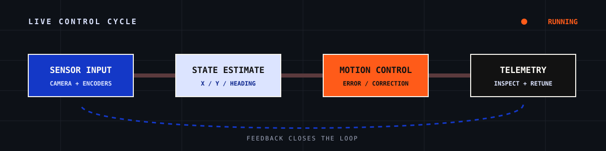
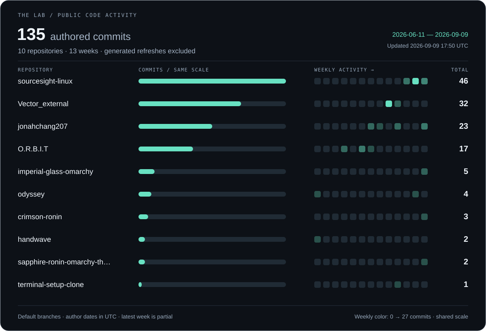
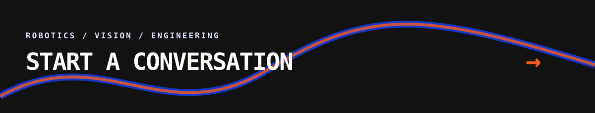

  

  <a href="https://portfolio-five-omega-y8vld3apbj.vercel.app/"><strong>PORTFOLIO</strong></a>
  &nbsp;&nbsp;/&nbsp;&nbsp;
  <a href="https://jonahchang207.github.io/odyssey/"><strong>ODYSSEY DOCS</strong></a>
  &nbsp;&nbsp;/&nbsp;&nbsp;
  <a href="mailto:saphirredragon207@gmail.com"><strong>EMAIL</strong></a>

 

## Code gets interesting when the real world pushes back.

I'm Jonah, a high school student who builds robots and the software behind them. I write competition code for VEX V5 team 56S and handle most of the robot's CAD.

A lot of my work starts with something difficult to observe: a robot drifting off its path, a camera losing an object, or an autonomous routine that takes too long to test on hardware. I build the system, then build the tools that help me see why it works or why it does not.

  

 

## Systems in motion

  

 

## Selected work

<table>
  <tr>
    <td width="50%" valign="top">
      <h3><a href="https://github.com/jonahchang207/odyssey">Odyssey</a></h3>
      <code>C++</code> <code>PROS</code> <code>Motion control</code>
        
      Robot localization and autonomous motion using odometry, PID, move-to-pose, and pure pursuit.
        
      <a href="https://jonahchang207.github.io/odyssey/"><strong>Read the documentation</strong></a>
    </td>
    <td width="50%" valign="top">
      <h3><a href="https://github.com/jonahchang207/odyssey-sim">Odyssey Simulator</a></h3>
      <code>TypeScript</code> <code>Simulation</code>
        
      A virtual VEX field for writing autonomous routines, watching them run, and generating C++ for the robot.
        
      <a href="https://github.com/jonahchang207/odyssey-sim"><strong>Open the simulator repository</strong></a>
    </td>
  </tr>
  <tr>
    <td width="50%" valign="top">
      <h3><a href="https://github.com/jonahchang207/FrameSight">FrameSight</a></h3>
      <code>Python</code> <code>YOLO</code> <code>ONNX</code>
        
      A transparent Windows overlay that captures the screen and draws object detections without blocking clicks.
        
      <a href="https://github.com/jonahchang207/FrameSight"><strong>Explore FrameSight</strong></a>
    </td>
    <td width="50%" valign="top">
      <h3><a href="https://github.com/jonahchang207/IRIS-Progect">IRIS</a></h3>
      <code>Robotics</code> <code>Computer vision</code> <code>IK</code>
        
      A vision-guided six-axis robotic arm that combines object detection, analytical inverse kinematics, and hardware control.
        
      <a href="https://github.com/jonahchang207/IRIS-Progect"><strong>Inspect the arm project</strong></a>
    </td>
  </tr>
</table>

 

## More routes

| Project | What I built | Tools |
| :--- | :--- | :--- |
| [Handwave](https://github.com/jonahchang207/handwave) | Hand tracking that turns pinches and swipes into cursor movement, clicks, scrolling, and dragging on macOS. | `Python` `MediaPipe` |
| [O.R.B.I.T](https://github.com/jonahchang207/O.R.B.I.T) | A low-cost 360-degree perception project for ranging, bearing, and persistent target tracking. | `Python` `Stereo vision` |
| [Vortex](https://github.com/jonahchang207/Vortex) | A VEX Robotics companion application for competition analytics, team information, and event data. | `Flutter` `Supabase` |
| [Harbor](https://github.com/jonahchang207/Harbor) | A local application for downloading and converting online video files. | `C#` `.NET` |
| [56S Override](https://github.com/jonahchang207/56S-Override) | Competition code for VEX team 56S, including autonomous movement, driver control, motors, and pneumatics. | `C++` `PROS` |

 

## Recent commit signal

This graph counts commits authored by me in public, non-fork repositories during the rolling last three months. It refreshes every day.

  

 

  
<strong>How I approach a project</strong>

   
  I measure what happened, correct the error, and build a clearer way to inspect the next run. That loop shows up everywhere in my work, whether I am tuning a drivetrain, tracking an object, or debugging a simulator.

 

  

